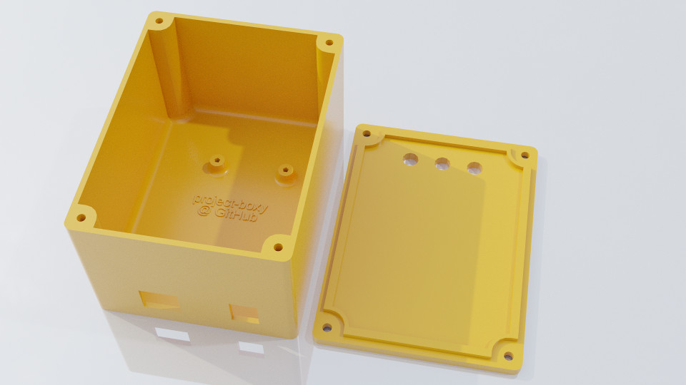

# Project: Boxy

OpenSCAD based parametric electronics project box generator.

## Notable customizable features
* Dimensions and fastener size
* Board standoffs
* Holes for panel mounted devices
* Included easy to use footprint for an Arduino UNO R3

### Box dimensions

The dimensions of the box are specified in terms of the exterior dimenssions rather than the interior dimensions. EXTERIOR_WIDTH, EXTERIOR_HEIGHT, EXTERIOR_DEPTH and THICKNESS have an effect on the interior dimensions of the project box.

| Dimension | Formula for interior dimension  |
|-----------|---------------------------------|
| Width     | EXTERIOR_WIDTH - 2 * THICKNESS  |
| Height    | EXTERIOR_HEIGHT - 2 * THICKNESS |
| Depth     | EXTERIOR_DEPTH - THICKNESS      |

LID_THICKNESS has no effect on the interior dimensions of the box, but be aware that the lid lip resides inside the project box when the box is closed.

### Panel mounting holes

Mounting holes are placed using a list of lists in the ROUND_HOLES variable using the following format:

    [[FACE, DIAMETER, H, V], ...]

Where FACE is an integer from 1 to 6 representing the following faces of the project box:

| Face   | Number |
|--------|--------|
| Right  | 1      |
| Left   | 2      |
| Front  | 3      |
| Back   | 4      |
| Bottom | 5      |
| Lid    | 6      |

DIAMETER is the diameter of the hole and H,V control the position of the hole on the face relative to the center of the face.

### Included Arduino footprint

ARDUINO_UNO controls whether the Arduino footprint is rendered. ARDUINO_UNO_ROTATION sets the rotation of the footprint and the footprint may be rotated 90, 180 or 270 degrees to face any of the walls of the project box. The footprint will be automatically aligned with the board edge to one of the walls of the box.

